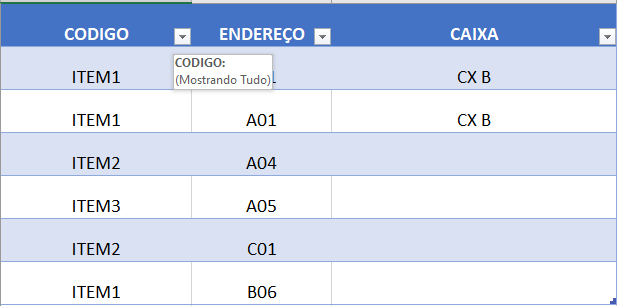

# Formatador de planilha excel

Um projeto para formatar a planilha do excel em formato compativel, para importação da mesma no sistema Carga Maquina que utilizamos onde eu trabalho atualmente , onde concatena os endereços de codigos iguais, em apenas uma linha.

# 💻 Visualização

1. Antes da formatação:

2. Após a formatação:

# 📚 Tecnologias Utilizadas!

